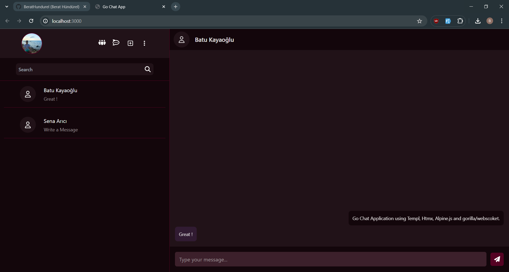

# Go Chat Application

This project is a real-time chat application written in Go, utilizing the power of Templ, HTMX, Alpine.js, and Gorilla WebSocket to create a interactive user experience.

## Features

-  **Real-time Messaging**: Real-time communication powered by Gorilla WebSockets.
-  **Dynamic UI**: Dynamic user interface with HTMX and Alpine.js.
-  **Add Friends**: Ability to add friends from a list of other users.

## Technologies Used

-  **Go**: The core programming language used to build the backend of the application.
-  **Templ**: A templating engine for Go, enabling efficient server-side rendering.
-  **HTMX**: A library that allows you to access modern browser features directly from HTML, providing a more dynamic user experience.
-  **Alpine.js**: A minimal JavaScript framework for composing behavior directly in your markup.
-  **Gorilla WebSocket**: A Go implementation of the WebSocket protocol, used for real-time communication.
-  **PostgreSQL**: A powerful, open source object-relational database system..
-  **Gorm**: ORM library for Golang.
